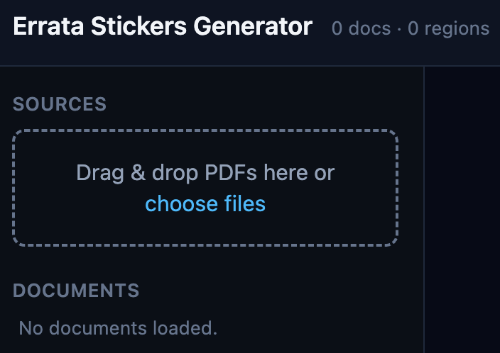
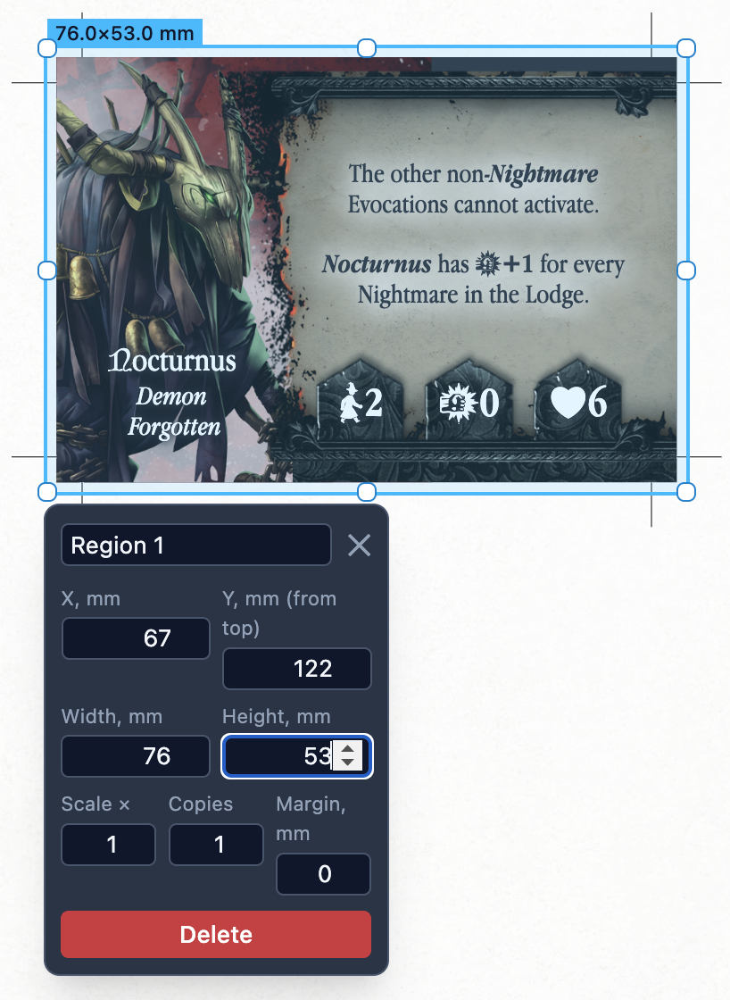
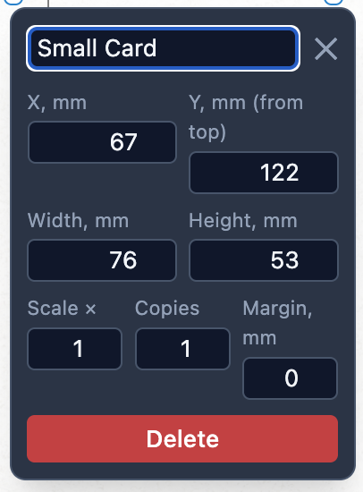
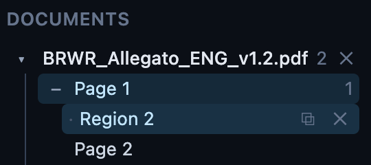
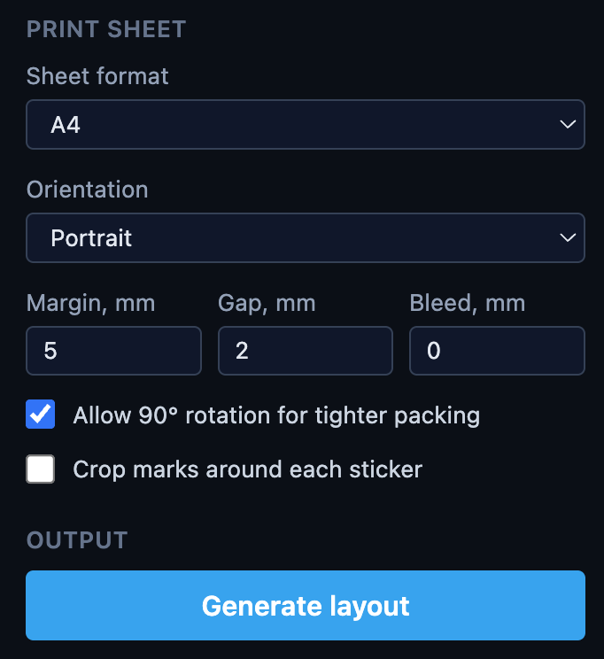
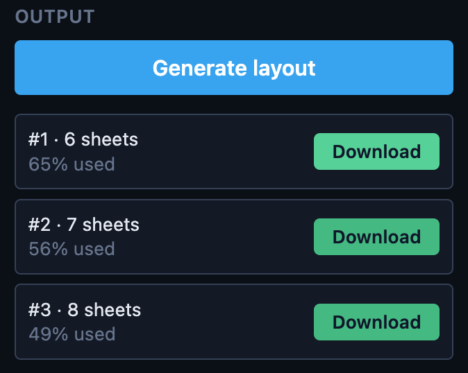
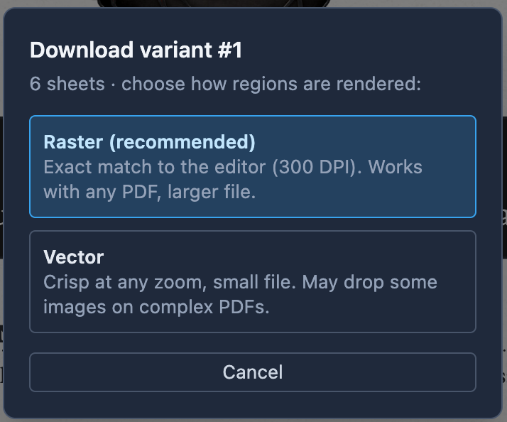
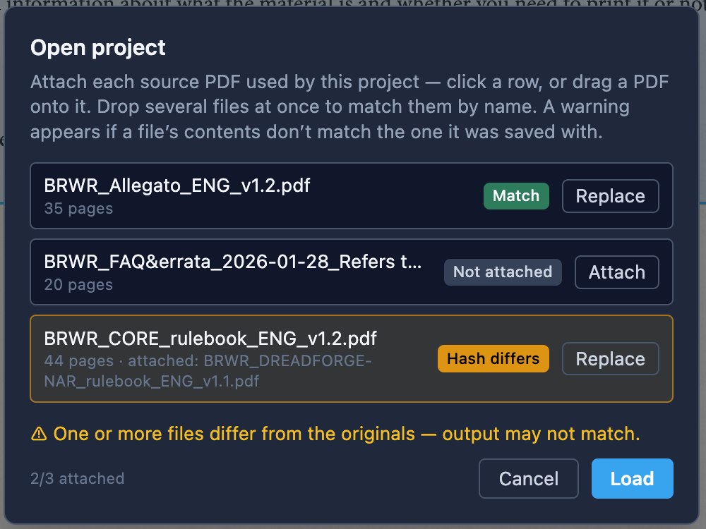
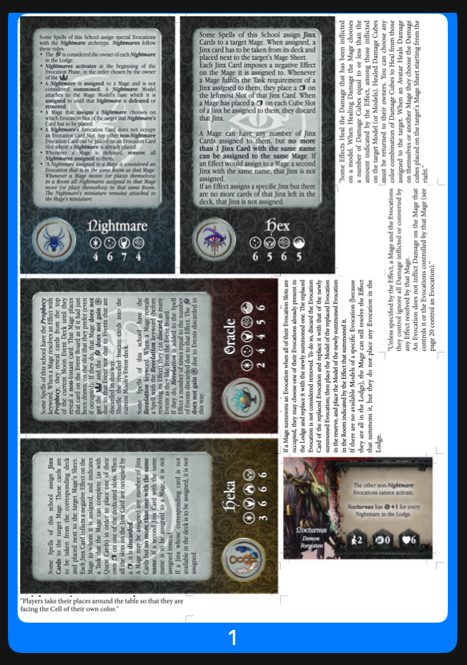

# Errata Stickers Generator

A fully client-side web app for turning **errata PDFs** into **print-ready sticker sheets**. Mark the
regions you care about on any PDF, and the app nests them onto your chosen paper format with bleed,
gaps and crop marks — then exports a single print-ready PDF. Everything runs in the browser: your
PDFs are never uploaded anywhere.

**Live demo:** https://pshutov.github.io/errata-stickers-generator/

---

## Features

- **Mark regions on any PDF** — draw, move and resize bounding boxes directly on the rendered page.
- **Precise per-region controls** — set X/Y/Width/Height in millimetres, output **scale**, number of
  **copies**, and an individual **margin** (extra empty space reserved around a single sticker).
- **Tree navigation** — Document → Page → Region, with quick duplicate and delete.
- **Free bin-packing** — regions are nested for maximum efficiency (not a fixed label grid). The app
  produces several layout **variants** and ranks them by fewest sheets / highest area utilisation.
- **Print prep** — sheet format & orientation, margins, inter-sticker gap, bleed, and optional
  **crop marks**.
- **Raster or vector export** — WYSIWYG raster (survives any source PDF) or crisp vector re-embed.
- **Save / load projects** — a small JSON project file references the source PDFs by name and stores a
  **SHA-256 hash** of each used PDF. On load you attach each file (drag-and-drop supported) and the app
  flags any file whose contents don't match the one it was saved with.
- **100% private** — no backend, no uploads. Works offline once loaded.

---

## Screenshots

> Screenshots live in [`docs/screenshots/`](docs/screenshots/).

### 1. Upload — drag & drop your PDFs


### 2. Mark a region on the page


### 3. Region inspector — scale, copies & per-region margin


### 4. Region tree — navigate, duplicate, delete


### 5. Sheet settings — format, margin, gap, bleed, crop marks


### 6. Packing variants — ranked by sheets & efficiency


### 8. Export — raster or vector


### 9. Load project — attach PDFs with hash verification


### 10. Print-ready output — bleed & crop marks


---

## Screenshot file reference

| # | File | What to capture (important / interesting moments) |
|---|------|----------------------------------------------------|
| 1 | `docs/screenshots/01-upload.png` | Empty state with the drag-&-drop zone; ideally mid-drag with the highlight active. |
| 2 | `docs/screenshots/02-mark-region.png` | A PDF page open with a region being drawn (selection box over an errata icon/text). |
| 3 | `docs/screenshots/03-region-inspector.png` | The floating inspector showing X/Y/W/H plus **Scale / Copies / Margin** fields. |
| 4 | `docs/screenshots/04-region-tree.png` | The Document → Page → Region tree with a `×N` copies badge and the duplicate/delete actions. |
| 5 | `docs/screenshots/05-sheet-settings.png` | Sheet panel: format & orientation, Margin/Gap/Bleed inputs, crop-marks toggle on. |
| 6 | `docs/screenshots/06-variants.png` | The variants list — several layouts with sheet count and efficiency %. |
| 8 | `docs/screenshots/08-download-modal.png` | The Raster / Vector download modal. |
| 9 | `docs/screenshots/09-load-dialog.png` | The load dialog with PDFs attached — one **Match** (green) and one **Hash differs** (amber). |
| 10 | `docs/screenshots/10-output-crop-marks.png` | The generated PDF opened in a viewer, showing bleed and crop marks around a sticker. |

---

## How it works

1. **Upload** one or more errata PDFs (drag-and-drop or file picker).
2. **Mark** the regions you want to print as stickers; tune scale, copies and margin per region.
3. **Configure** the sheet: paper format, margins, gap, bleed and crop marks.
4. **Generate** — the app computes several packing variants; pick one.
5. **Download** the print-ready PDF (raster or vector).
6. **Save** the project to re-open later; the saved file fingerprints each source PDF so you always
   re-attach the exact same originals.

Coordinates are stored in PDF user-space points, so marks stay correct across zoom and feed straight
into the output. Regions are rasterised through pdf.js at 300 DPI for pixel-accurate output, or
re-embedded as vectors when you prefer.

---

## Tech stack

- **Vite + React + TypeScript**
- **Tailwind CSS v4**
- **pdf.js** — renders pages and rasterises regions
- **pdf-lib** — clips/embeds and builds the output PDF
- **maxrects-packer** — free bin-packing
- **zustand** — state

---

## Local development

```bash
npm install
npm run dev      # start the dev server
npm run build    # type-check + production build
npm run preview  # preview the production build
```

---

## Deployment (GitHub Pages)

Deployment is automated via GitHub Actions ([`.github/workflows/deploy.yml`](.github/workflows/deploy.yml)).
On every push to `main` the app is built and published to GitHub Pages. The Vite `base` is derived
automatically from the repository name, so assets and the pdf.js worker resolve correctly under the
project subpath.

To enable it on a fresh repo: **Settings → Pages → Build and deployment → Source = "GitHub Actions"**.

---

## Privacy

The app is entirely client-side. PDFs are processed in your browser and never leave your machine —
there is no server to send them to.
